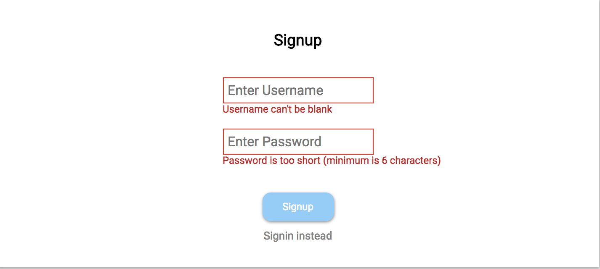

# Calendar App

A 2018 calendar implementation that allows you to create, update and delete events

Live version [here](http://soundtown.herokuapp.com/#/).

# Functionality
## User Auth

  * Signup / Signin to view your calendar
  * Or use demo to signin as a demo user

* View year calendar
  * click individual month to get month view
  * hover over individual days to get the day event count

# Front End Specs
 - [x] The UI should have one month hard coded view (Pick any month)
 - [x] Ignore users/login, just have one hardcoded user
 - [x] Click on a day box, and be able to create a new event on that day which gets sent to the backend on clicking submit
   * The form should have start time, end time, description and submit
   * Once submit is clicked the form should disappear
   * Event should now appear in that day’s box
   * Events cannot span multiple days. Must start and end the same day
 - [x] Show all events the user has on their calendar
 - [x] The UI should have 4 rows of 7 boxes (simple case of a 28 day month)
 - [x] The application should communicate with an API backend using JSON. Don’t spend a lot of time on the UI making it look beautiful; just make it functional

# Front End Specs (Optional):
- [x] Switch between months
- [x] Week or day view
- [ ] Handle events spanning multiple days
- [x] Handle too many events to fit in your box UI on a given day
- [x] You should be able to update/delete events. How you implement this UX is up to you
- [x] The UI should have 5 rows of 7 boxes with the correct date on the correct days


```javascript
{ currentSong:
 { song: {id: 23, user_id: 5, title: "SongTitle", etc...}
   isPlaying: False
 }
}
```

# Back End Specs (Minimum Required API):
- [x] POST /events
  * Should create an event

- [x] GET /events
  * Should return all events

# Back End Specs (Optional):
- [x] DELETE /events/:id
  * Should delete an event

- [x] PUT /events/:id
  * Should update an existing event

# Key Code Snippets:
```javascript
componentDidMount() {
  this.props.searchSongs(this.state.inputVal);
}

handleInput(event) {
 this.setState({inputVal: event.currentTarget.value});
}
```

# Tests:
