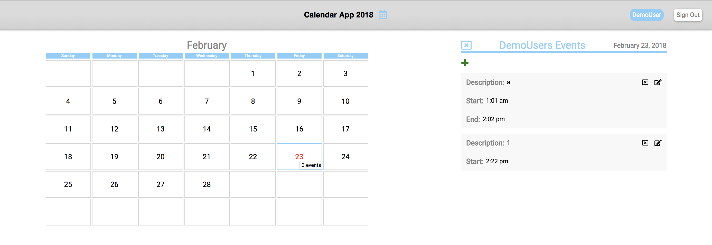
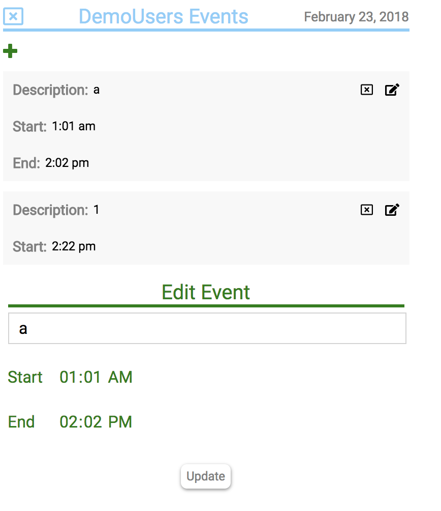

# Calendar App
A 2018 calendar implementation that allows you to create, update and delete events
Live version [here](http://soundtown.herokuapp.com/#/).

# Functionality
## User Auth

  * Signup / Signin to view your calendar
  * Or use demo to signin as a demo user

## Year View
  * Click individual month to get month view
  * Hover over individual days to get the day event count
  * Days with events highlighted red

## Month View

  * Click individual day to get day view / days events
  * Days with events highlighted red
  * Hover over individual days to get the day event count
  * Click Calendar 2018 Header to return to year view

## Day View
  * View each event for the day
  * Open event form to create new event
  * Click icons to delete / update events
  * Click Calendar 2018 Header to return to year view

## Create / Update Event

  * Validations for presence of description, start time and end time
  * No invalid time ranges (end time before start time)
  * Maximum 10 events per day

# Front End Specs
 - [x] The UI should have one month hard coded view (Pick any month)
 - [x] Ignore users/login, just have one hardcoded user
 - [x] Click on a day box, and be able to create a new event on that day which gets sent to the backend on clicking submit
   * The form should have start time, end time, description and submit
   * Once submit is clicked the form should disappear
   * Event should now appear in that day’s box
   * Events cannot span multiple days. Must start and end the same day
 - [x] Show all events the user has on their calendar
 - [x] The UI should have 4 rows of 7 boxes (simple case of a 28 day month)
 - [x] The application should communicate with an API backend using JSON. Don’t spend a lot of time on the UI making it look beautiful; just make it functional

# Front End Specs (Optional):
- [x] Switch between months
- [x] Week or day view
- [ ] Handle events spanning multiple days
- [x] Handle too many events to fit in your box UI on a given day
- [x] You should be able to update/delete events. How you implement this UX is up to you
- [x] The UI should have 5 rows of 7 boxes with the correct date on the correct days

# Back End Specs (Minimum Required API):
- [x] POST /events
  * Should create an event

- [x] GET /events
  * Should return all events

# Back End Specs (Optional):
- [x] DELETE /events/:id
  * Should delete an event

- [x] PUT /events/:id
  * Should update an existing event

# Key Code Snippets:
* Avoid invalid time ranges
```ruby
def start_time_before_end_time
  if start_time && end_time
    start_hours = start_time[0..1].to_i
    start_minutes = start_time[3..-1].to_i

    end_hours = end_time[0..1].to_i
    end_minutes = end_time[3..-1].to_i
  end

  if self.month && self.day
    if Time.new(2018,month.num,1,day.num,start_hours,start_minutes, 0) > Time.new(2018,month.num,1,day.num,end_hours,end_minutes, 0)
      errors[:base] << 'Start time must come before end time'
    end
end
```
* Limit events per day
```ruby
def max_event_per_day_quota
  if self.day
    if self.day.events.length > 9
      errors[:base] << 'Max events per day is 10'
    end
  end
end
```

# Tests:
Includes both model and controller testing for validations, associations and api calls.  To runs tests, simply install and run rspec.
